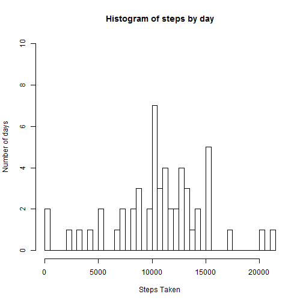
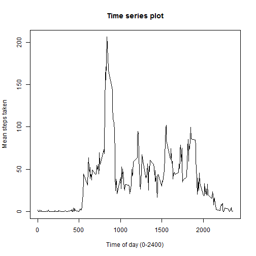
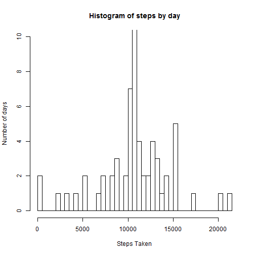
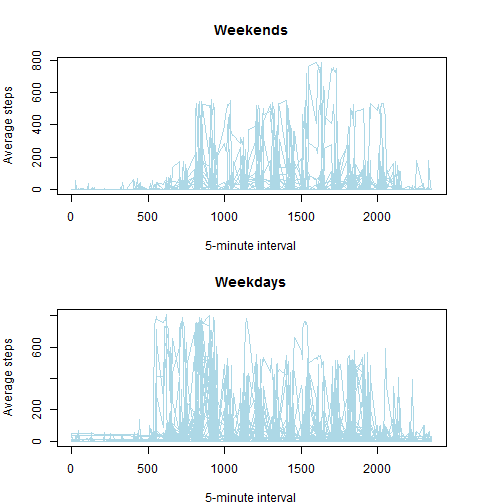

Analysis of activity data
=================================================


Before anything else, download the data to your working directory.

Read the data in

```r
unzip("./repdata_data_activity.zip")
actdata <- read.csv("./repdata_data_activity/activity.csv")
```

##What is the mean total number of steps taken per day?

Calculate the total number of steps taken per day

```r
stepsbyday <- aggregate(steps ~ date, actdata, sum)
```

Here's a histogram to show it.

```r
hist(stepsbyday[,2], ylab="Number of days", xlab="Steps Taken", main="Histogram of steps by day", breaks=61, ylim=c(0,10))
```

 

Calculate the mean and median.

```r
meansteps <- mean(stepsbyday[,2], na.rm=TRUE)
mediansteps <- median(stepsbyday[,2], na.rm=TRUE)
```
The mean number of steps per day is 1.0766189 &times; 10<sup>4</sup>, and the median number of steps per day is 10765.

##What is the average daily activity pattern?

Determine the average number of steps taken during each 5-minute interval, averaged across all days

```r
stepsbyinterval <- aggregate(steps ~ interval, actdata, mean)
```

Here's a time series plot of the 5-minute interval and the average number of steps taken, averaged across all days.

```r
plot.ts(stepsbyinterval[,1], stepsbyinterval[,2], xlab="Time of day (0-2400)", 
        ylab="Mean steps taken", main="Time series plot", type="l")
```

 

Which 5-minute interval, on average across all the days in the dataset, contains the maximum number of steps?

```r
stepsbyinterval[which.max(stepsbyinterval[,2]),1]
```

```
## [1] 835
```
We find that the maximum number of steps per interval comes at time interval 835 - that is, 8:35 to 8:40 AM.

##Imputing missing values

How many missing values are there in the dataset?

```r
length(actdata$steps[actdata$steps == "NA"])
```

```
## [1] 2304
```
There are 2304 missing steps values. So, let's fill them in!

We do this by setting up a loop that performs these 4 tasks at each iteration:
1) Check whether the steps value is missing.
2) If so, identify the interval during which those steps took place.
3) Match the row number of that interval to the corresponding row number in the set of average steps by interval.
4) Take the average steps at that interval, and use that to replace the missing value.

```r
interpolatedata <- actdata
for (i in 1:nrow(interpolatedata)){
  if (is.na(interpolatedata$steps[i])){
    targetinterval <- actdata$interval[i]
    rownum <- which(stepsbyinterval$interval == targetinterval)
    imputesteps <- stepsbyinterval$steps[rownum]
    interpolatedata$steps[i] <- imputesteps
  }
}
```

interpolatedata is a new dataset that is equal to the original dataset, but with the missing data filled in.


Here's a histogram of the total number of steps taken each day, followed by the mean and median total number 
of steps taken per day. 

```r
interpolatedstepsbyday <- aggregate(steps ~ date, interpolatedata, sum)
hist(interpolatedstepsbyday[,2], ylab="Number of days", xlab="Steps Taken", main="Histogram of steps by day", breaks=61, ylim=c(0,10))
```

 

```r
interpmeansteps <- mean(interpolatedstepsbyday[,2])
interpmediansteps <- median(interpolatedstepsbyday[,2])
```

Do these values differ from the estimates from the first part of the assignment? Not much! The interpolated mean, 1.0766189 &times; 10<sup>4</sup>, equals the non-interpolated mean, 1.0766189 &times; 10<sup>4</sup>.

Interpolating does slightly increase the median, from 10765 to 1.0766189 &times; 10<sup>4</sup>. And interestingly, this makes the median match the mean.

Comparing the two histograms, we see that imputing missing data increases estimates of the total number of daily steps - but not dramatically so.

##Are there differences in activity patterns between weekdays and weekends?

Create a new factor variable in the dataset with two levels – “weekday” and “weekend.” 

```r
interpolatedata$weekend <- weekdays(as.Date(interpolatedata$date))

for (i in 1:nrow(interpolatedata)){
  if (interpolatedata$weekend[i] == "Sunday"){
    interpolatedata$weekend[i] <- "Weekend"
     }
  else if (interpolatedata$weekend[i] == "Saturday"){
    interpolatedata$weekend[i] <- "Weekend"
     }
  else {
    (interpolatedata$weekend[i] <- "Weekday")
     }
}

interpolatedata$weekend <- as.factor(interpolatedata$weekend)
```

Here's a panel plot containing a time series plot of the 5-minute interval and the average 
number of steps taken, averaged across all weekday days or weekend days.

```r
weekendsteps <- aggregate(steps ~ interval+weekend, interpolatedata, mean)

par(mfrow = c(2, 1), mar = c(4, 4, 4, 4))
with(subset(interpolatedata, weekend == "Weekend"), plot.ts(interval, steps, main = "Weekends", type="l", 
                                                    xlab="5-minute interval", ylab="Average steps", col="lightblue"))
with(subset(interpolatedata, weekend == "Weekday"), plot.ts(interval, steps, main = "Weekdays", type="l", 
                                                    xlab="5-minute interval", ylab="Average steps", col="lightblue"))
```

 

```
